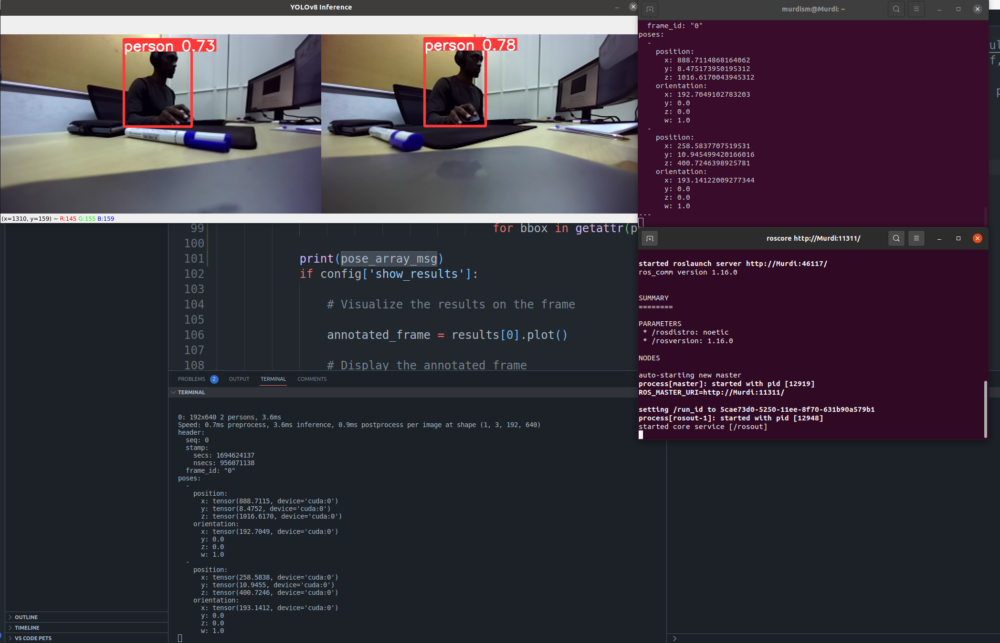

# yolov8_ROS
Detect agents with yolov8 in real-time and publish detection info via ROS 


## Required Packages:
Since this package is based on [ultralytics/yolov8], python>=3.8 is required.

You need to have ultralytics installed in your workspace. You can do it by running the following commands:   

```pip install ultralytics```

You will also need Rospy. You can install it by running the following commands:   

```pip install rospkg```

For visiualization purposes you might need opencv. You can install it by running the following commands:   

```pip install opencv-python```

## How to run:
1. Clone this repository in your workspace.
2. Install the packages needed.
3. Run the following command in your workspace:   

    ```python3 yolov8_ros.py```

## ROS  
The publisher data type is a pose array with a frame_id in the header and array of poses. Each pose represents a detected agent. The pose contains the bbox of the agent in the image. 
Note: since pose has 3 values the fourth value of the bbox is in the orientation of the pose.

Example 
```
header: 
  seq: 1312
  stamp: 
    secs: 1694624194
    nsecs: 492149829
  frame_id: "0"      --> frame id
poses: 
  - 
    position: 
      x: 236.40818786621094   -> assuming xyxy is used this is x1 value of agent 0
      y: 0.7245025038719177   -> assuming xyxy is used this is y1 value of agent 0
      z: 412.4126281738281    -> assuming xyxy is used this is x2 value of agent 0
    orientation: 
      x: 194.5230712890625    -> assuming xyxy is used this is y2 value of agent 0  
      y: 0.0
      z: 0.0
      w: 1.0
  - 
    position: 
      x: 868.2145385742188
      y: 0.1385238617658615
      z: 1019.5242309570312
    orientation: 
      x: 191.39376831054688
      y: 0.0
      z: 0.0
      w: 1.0
  - 
    position: 
      x: 865.4376220703125
      y: 0.0
      z: 1077.7840576171875
    orientation: 
      x: 193.37823486328125
      y: 0.0
      z: 0.0
      w: 1.0
---
```


# Evaluation
When tested with zed camera at 15 fps the average inference time was around 4ms.   
There were some frame which took more than 10ms to process but for most frames the inference time was between 3-5ms. 